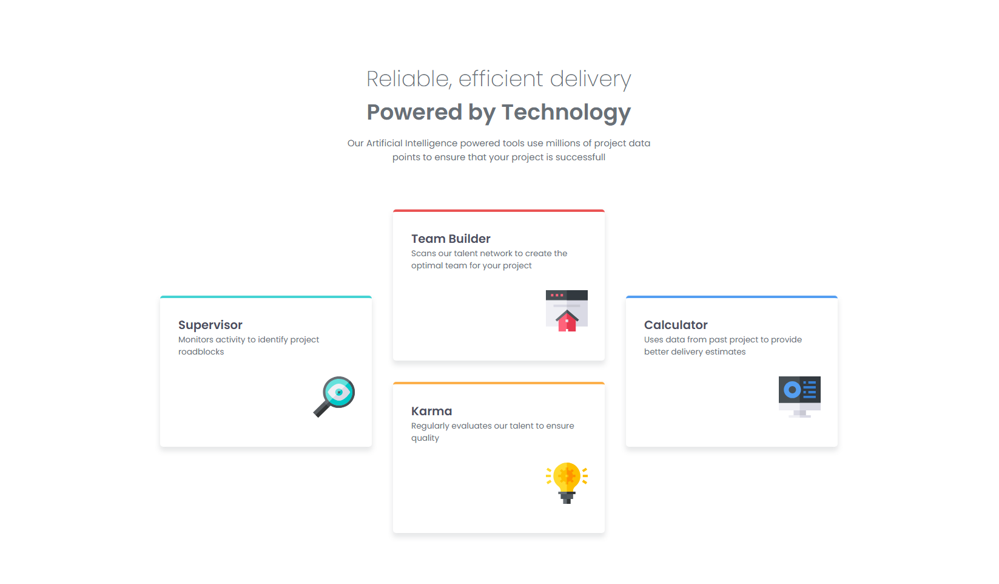
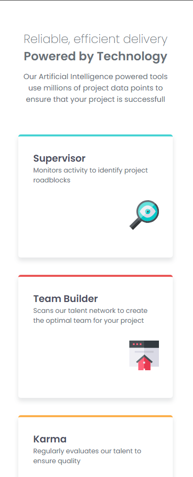

### The challenge

- This challenge teach me how to implement responsive layout using flex and grid. 

### Screenshot

- Desktop page



- Mobile page



### Links

- https://github.com/rizard1/four-card-section - My github solution
- https://rizard1.github.io/four-card-section/ - Site url

## My process

### Built with

- Semantic HTML5 markup
- CSS custom properties
- Flexbox
- Grid
- Desktop-first workflow

### What I learned

From this project, i learn:

- How to structure the layout.
- Creating card structure with grid.
- Using @media rule for making responsive design.  

Below is some sniffet code:
``` 
CSS
/* CARD SECTION */
main {
    color: hsl(234, 12%, 34%);
    display: grid;
    gap: 35px;
    grid-template-columns: repeat(3, 1fr);
    /* grid-template-rows: 1fr 1fr 1fr; */
    grid-template-areas: 
    ".... box2 ...."
    "box1 box2 box4"
    "box1 box3 box4"
    ".... box3 ....";
}  

```

### Continued development

Even though I’ve completed this challenge, there’s still plenty of room for improvement—especially in the code handling layout transitions from mobile to desktop, whether through the CSS box model, @media rules, or other techniques.

### Useful resources

- [Kevin Power - responsive layout](https://www.youtube.com/watch?v=JFbxl_VmIx0) - This helped me how to use grid especially on card components.
- [MDN Doc](https://developer.mozilla.org/en-US/docs/Web/CSS) - This is main source.

## Author

- Github - [Rizard](https://github.com/rizard1)
- Frontend Mentor - [@rizard1](https://www.frontendmentor.io/profile/rizard1)
